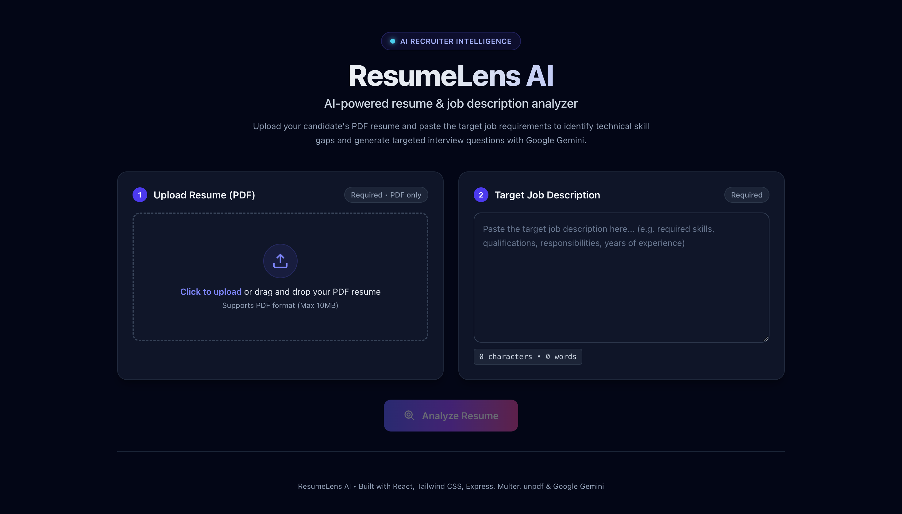
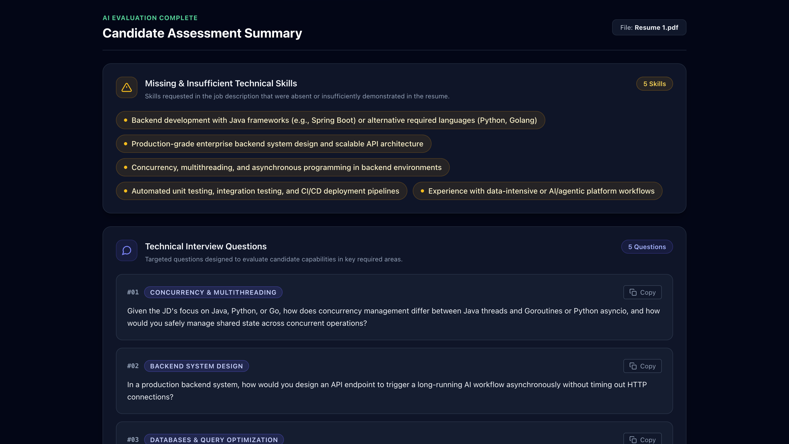

# ResumeLens AI

ResumeLens AI is an AI-powered resume analyzer that compares a candidate's resume with a job description and identifies technical skill gaps and relevant technical interview questions.

The application uses Google Gemini to analyze the resume and job description and return structured results.

## Features

- Upload a resume in PDF format
- Paste a job description
- Extract text from the uploaded PDF
- Analyze the resume using Google Gemini
- Identify missing or insufficient technical skills
- Generate relevant technical interview questions
- Structured JSON response from the backend
- REST API architecture
- Secure API key handling using environment variables
- No database required






## Tech Stack

### Frontend
- React
- Vite
- Axios
- Tailwind CSS

### Backend
- Node.js
- Express.js
- Multer
- PDF parser
- Google Gemini API
- dotenv
- CORS

## Project Structure

```text
ResumeLens-AI/
│
├── client/                     # React frontend
│
├── server/                     # Express backend
│   ├── src/
│   │   ├── config/
│   │   │   └── gemini.js
│   │   │
│   │   ├── controllers/
│   │   │   └── analyzeController.js
│   │   │
│   │   ├── middlewares/
│   │   │   └── uploadMiddleware.js
│   │   │
│   │   ├── routes/
│   │   │   └── analyzeRoutes.js
│   │   │
│   │   ├── services/
│   │   │   ├── geminiService.js
│   │   │   └── pdfService.js
│   │   │
│   │   ├── app.js
│   │   └── server.js
│   │
│   ├── .env.example
│   ├── package.json
│   └── README.md
│
├── .gitignore
└── README.md